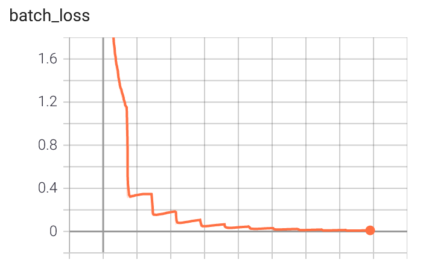
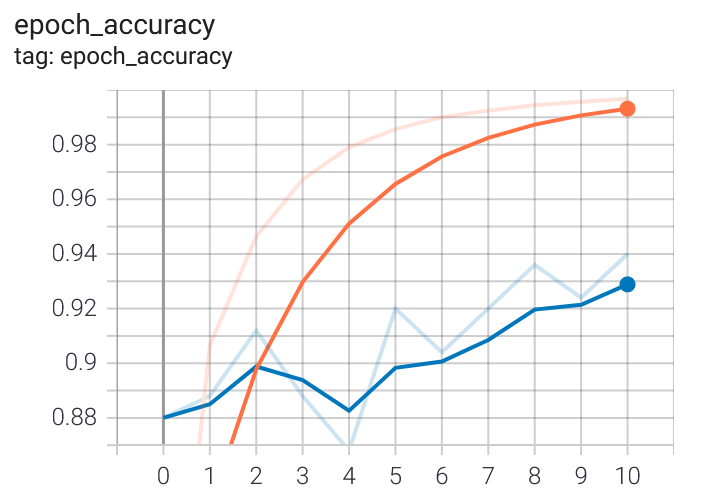

# OnlineHanziRecognizer

This project is an implementation of the paper "Deep Convolutional Network for Handwritten Chinese Character Recognition" by Yuhao ZHUANG.
It is based on a convolutional neural network (CNN) trained on the [CASIA](http://www.nlpr.ia.ac.cn/databases/handwriting/Touching_Characters_Databases.html) database (database of handwritten chinese characters with annotation).


### Requirements :
Python version: 3.6.3

Tensorflow version: 2.5.0

### Installing the dependencies :

```
pip install -r requirements.txt
```

## Project options

### Generate the training and test dataset:

The dataset used is the HWDB1.1 dataset. 
This dataset contains 3,755 Chinese characters and 171 alphanumeric
and symbols. Each class of character is represented by 300 handwritten images drawn by 300 writers. 
Each writer has written the 3 755 Chinese characters. 

To download it :
http://www.nlpr.ia.ac.cn/databases/download/feature_data/HWDB1.1trn_gnt.zip
http://www.nlpr.ia.ac.cn/databases/download/feature_data/HWDB1.1tst_gnt.zip

In ImageDatasetGeneration.py, set the CASIA_DIR variable to the path where you installed the dataset.

``` python ImageDatasetGeneration.py ```

Executing this script takes roughly 30 minutes to execute. 
The directory GNT_TRAINING_PATH contains 240 .gnt files. Each .gnt file contains 3000 characters written by one writer.
The directory GNT_TEST_PATH contains 60 .gnt files. Each .gnt file contains 3000 characters written by one writer.
The script extracts all the character images contained in one gnt file and put each extracted
image into its corresponding directory.
It then creates the validation directory using half of the images in the test directory.


### Start training:

``` python start.py --mode=training ```

To visualize metrics such as loss and accuracy using Tensorboard :

``` tensorboard --logdir=./logs/ --port=8090 --host=127.0.0.1 ```
 
In a browser , go to : http://localhost:8090/

### Launching the Web server :

The project comes with a simple web user interface for drawing characters with the mouse.
The interface displays the recognized characters, as the character is drawn.

``` python app.py ``` 

In a browser , go to : http://localhost:5000/

### Recognizing images 

``` python  start.py --mode=recognize_image ```

### Convert the model to TensorLite

``` python  start.py --mode=convert_to_tensor_lite ```

## The model training

The implemented model corresponds to the six layers M6 model as defined in the paper:


Training took 2 days on a Dell XPS (16 Go, Nvidia GeForce GTX 1050 with 4 Gb) and accuracy on validation set is 93.33 and 93.1 % on test set.

### Batch loss




### Training/validation accuracy per epoch




 


